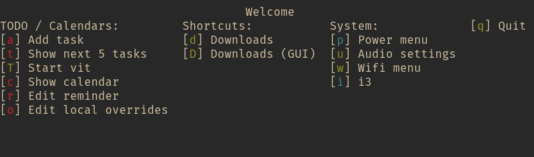

# tydra

> Terminal Hydra

[![Build Status][ci-badge]][ci] [![codecov][codecov-badge]][codecov]

Tydra is a menu-based shortcut runner based on the Hydra system in Emacs.

It works by reading an "action file" that defines the full menu. Each menu has
several pages, where one page at a time can be shown. Each page has one or more
entries, each of which has a shortcut key, a command, and a label.

With these building blocks you can build deeply nested menus with a diverse
range of commands, all behind a very simple shortcut system.

Contrast having to remember long commands (in terminal), or long complicated
shortcuts (in GUI), with a single command/shortcut and then having a menu
overlaid with each entry a single keystroke away.

Tydra makes it easier to add new things to your setup without having to come up
with a globally unique shortcut, while still being possible to remember it even
when it is not used often.

Some possible use-cases:

  * Control your media player.
  * Change your screen brightness and volume without RSI.
  * Bookmark programs with specific arguments, or websites.
  * Keep track of commonly used "recipes" and scripts.

[](doc/screenshot1.png)

## Usage

See [doc/tydra.1.md](doc/tydra.1.md) for more information.

## Installing

Packaging will be done on the 1.0.0 release. For now you can install using
`cargo install`.

### Completions

This command comes with support for shell autocompletions for **bash**,
**zsh**, and **fish**.

You can generate and install these completions globally:

```bash
tydra --generate-completions zsh > _tydra
tydra --generate-completions bash > tydra.bash
tydra --generate-completions fish > tydra.fish

sudo install -Dm644 _tydra \
  /usr/share/zsh/site-functions/_tydra

sudo install -Dm644 tydra.bash \
  /usr/share/bash-completion/completions/tydra

sudo install -Dm644 tydra.fish \
  /usr/share/fish/completions/tydra.fish
```

If you have a local source for completions, redirect the output of the
`--generate-completions` command to the appropriate location.

## Copyright

Copyright 2018 Magnus Bergmark <magnus.bergmark@gmail.com>

Code is released under MIT license, see `LICENSE`.

[ci-badge]: https://travis-ci.org/Mange/tydra.svg?branch=master
[ci]: https://travis-ci.org/Mange/tydra
[codecov]: https://codecov.io/gh/Mange/tydra
[codecov-badge]: https://codecov.io/gh/Mange/tydra/branch/master/graph/badge.svg
